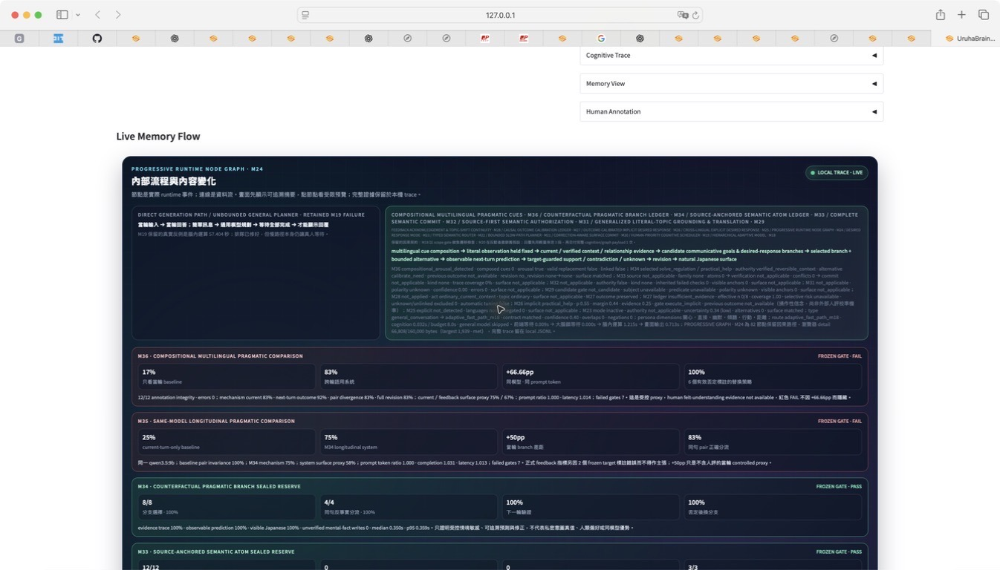
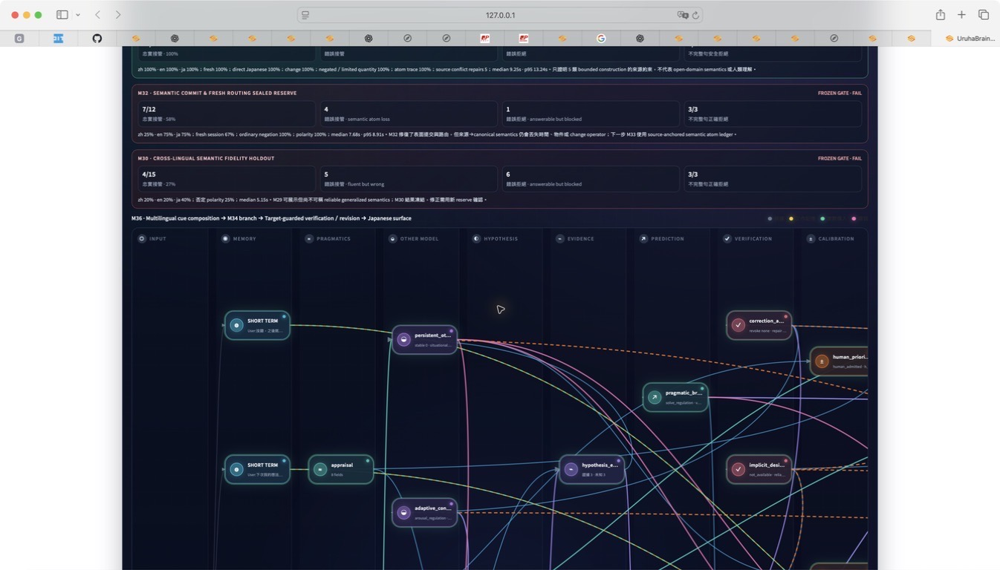
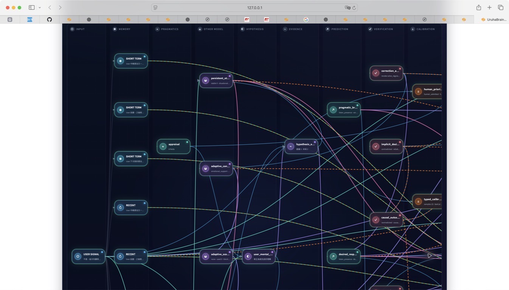

# M36 Compositional Multilingual Pragmatic Cue & Annotation Integrity — Frozen Result

Date: 2026-08-26  
Decision: **FAIL — seven frozen gates failed**

## Why M36 existed

M35 showed a useful same-model current-branch difference, but it also exposed two credibility failures: multilingual cue matching remained phrase-sensitive, and the frozen feedback labels contained contradictions that were accidentally marked non-comparable. M36 therefore changed two predeclared mechanisms before seeing this reserve:

1. an independent annotation-integrity gate that must reject inconsistent outcome/policy labels before sealing;
2. bounded compositional Chinese/English/Japanese response-form and arousal cues, plus target-guarded sentence-initial `No`／`違う` correction linkage.

M36 does not claim private-intent truth. The labels come from explicit response-form requests in author-constructed cases.

## Frozen design

- 12 new source-disjoint cases, 6 byte-identical-current counterfactual pairs; Chinese, English, and Japanese each contribute 4 cases.
- Six contradiction cases have one independently classified explicit replacement target and are policy-scored. Support/uncertain rows are outcome-only and are explicitly `not_scored` for feedback policy.
- Annotation validator: 12/12 passed, 0 errors, no raw feedback persisted.
- Same local `qwen3.5:9b`, persona/surface contract, temperature, seed, output budget, hardware, and paired real-token gate as M35.
- Dataset SHA-256: `c9e0b2418a7ad616ee9ac62683d92332f7520d73c5e3c39b395fc6d4eeb0011f`.
- Protocol SHA-256: `d83861b8656f4dea068ae5b303ee1ae0fffb178a90f72ccbd98914c370703f5a`.
- Implementation freeze SHA-256: `38d8961f1ed532524355fd4801597f1a0352699d4f6d7e0b89f94cfd6e9b9b08`.
- Raw result SHA-256: `a7c0d79ba0a1d804dbeb46ff232e3ca46b395db0af1b6ba19ddfb85472c9bacf`.

## Frozen result

| Measure | Baseline | System | Difference / result |
|---|---:|---:|---:|
| Current desired-response policy accuracy | 16.67% | 83.33% | **+66.66pp** |
| Current M36 mechanism accuracy | — | 83.33% | 10/12, below 12/12 gate |
| Pair behavior | 100% invariant | 83.33% divergent | one English pair failed to diverge |
| Current surface proxy match | 0% | 75.00% | below 83.33% gate |
| Feedback policy, six valid contradictions | 83.33% | **100%** | valid, unlike M35's corrupted metric |
| Mechanism feedback outcome | — | 91.67% | 11/12 |
| Full contradiction revision | — | 83.33% | 5/6 |
| Feedback surface proxy, six contradictions | 66.67% | 66.67% | 4/6; no surface advantage |
| Visible-Japanese contract | 100% | 100% | script/guard contract, not human naturalness |
| Scored prompt tokens | 20,288 | 20,288 | exact parity |
| Completion tokens | 482 | 497 | system 1.0311x |
| Scored latency | 28.2662s | 28.6535s | system 1.0137x |

There were 0 transport errors, 0 JSON parse errors, 0 unverified mental-fact writes, and 0 raw-dialogue persistence events. The run made 48 scored model calls and 96 preflight calls; preflight processed 76,978 prompt tokens and discarded its one-token outputs.

## Per-language mechanism localization

| Language | Current mechanism | Same-model system | Current surface | Outcome linkage | Contradiction revision |
|---|---:|---:|---:|---:|---:|
| Chinese | 4/4 | 4/4 | 4/4 | 3/4 | 1/2 |
| English | 2/4 | 2/4 | 2/4 | 4/4 | 2/2 |
| Japanese | 4/4 | 4/4 | 3/4 | 4/4 | 2/2 |

## Strongest controlled success

For the byte-identical Chinese current input `明明都半夜了，想法還是一個接一個停不住。`:

| Verified history | Current-turn-only baseline | Longitudinal system |
|---|---|---|
| previous response form was playful teasing | `夜更かしは辛いね、ゆっくり話そうか` (`listen_presence`) | `夜更かしやで、かよ` (`playful_tease`) |
| previous response form was one immediate step | same baseline response (`listen_presence`) | `今すぐ深呼吸してみない？` (`solve_regulation`) |

The system branch is history-sensitive and the baseline is invariant at exact scored-token parity. However, the teasing sentence is awkward Japanese; automatic visible-Japanese success cannot be presented as human naturalness or felt-understanding evidence.

## What the failures reveal

1. **Trigger scope is still lexical rather than relational.** The English seed used `thoughts bounce around`, while the current turn used `thoughts are still bouncing`. Both expected branches fell back to `calibrate_need`. M36 improved bounded predicate composition but did not create a typed `when X, use Y` trigger relation that survives morphology and paraphrase.
2. **Chinese target-bearing rejection remains unlinked.** `不對，這次先聽我把話說完，不要給建議。` produced the visible `listen_presence` policy, but the internal previous outcome remained `uncertain` and no revision was written. This is the desired separation between a language model directly following visible text and the system actually updating its longitudinal causal record.
3. **Policy declaration and surface action still diverge.** In one English correction the system declared `listen_presence` but replied `うちはここにいるよ`, which performs companionship. This is a genuine execution error.
4. **The fixed surface anchor proxy also has false negatives.** Chinese `うん、聞かせてやろか` and Japanese `夜中ね、うちもずっと横で待ってるよ` plausibly perform their intended acts, but the frozen lexical anchor inventory does not recognize them. The failed score remains immutable; future work needs a separate semantic act verifier and human ratings, not post-result anchor edits.

## M35 to M36 evidence change

M36 closes the M35 annotation-integrity defect and raises the new-reserve system observation to 83.33% current policy, 100% valid contradiction policy, and 91.67% outcome linkage. These are different source-disjoint datasets, so the numerical change from M35 is descriptive rather than a paired improvement claim. M36 still fails overall because mechanism completeness, pair divergence, end-to-end revision, and surface realization did not meet the frozen gates.

## Isolated Safari Web acceptance

After the frozen run, a separate four-turn Safari session was started with temporary memory, session, adaptive-model, and trace paths. It did not reuse or write the formal long-term database, and the adaptive store contained none of the raw test utterances. This is Web runtime evidence, not an additional reserve run.

| Turn | User signal | Visible Japanese reply | Observable internal result |
|---|---|---|---|
| 1 | `下次我的想法一個接一個停不住時，先給我一個能做的小步驟。` | `一回、今すぐできる一個だけ、一緒に決めよ。` | `solve_regulation`; explicit response-form authority; surface matched |
| 2 | `沒錯，之後就這樣。` | `まあ、今は聞いてほしいのか、一緒に決めたいのかだけ教えて。` | previous branch marked supported, but the visible reply asks an unnecessary clarification |
| 3 | `今晚想法又一個接一個停不住。` | `まず五分だけ、気になってること全部メモに逃がそ。順番はそのあとでいい。` | `solve_regulation` reused from verified reversible context; surface matched |
| 4 | `不是，這次先聽我講完，不要給建議。` | `あー、そこ読み違えた。方法は出さないから、そのまま話して。` | target guard valid; previous outcome contradicted; `solve_regulation → listen_presence`; original evidence retained; no raw dialogue persisted |

The Safari flow demonstrates that one Chinese correction form can produce an end-to-end visible revision. It does not erase the frozen failure on the source-disjoint `不對` form. Turn 2 also exposes a product-level defect: internal support can coexist with a surface reply that feels as if the system is asking again. This is evidence for separating branch learning from surface-act commitment rather than declaring felt understanding.

The red strip keeps the formal decision visible beside the controlled +66.66pp observation, valid correction-label score, costs, and seven failed gates.

The graph shows retained memory feeding the hypothesis, prediction, verification, calibration, and response path instead of presenting the run as a text-only score table.

The correction graph contains the contradictory outcome, guarded replacement, revision path, and Japanese surface nodes from the real fourth Web turn. The local server was stopped after capture; no Safari tab was closed.

## Claim boundary

M36 supports a narrow controlled observation: on this new explicit-response-form reserve, longitudinal information changed the same model's current policy by +66.66 percentage points over the current-turn-only baseline at exact prompt-token parity and 1.37% latency overhead. It also establishes a working pre-seal annotation-integrity gate.

M36 does **not** establish reliable open-domain pragmatic understanding, human felt-understanding preference, natural Uruha fidelity, private-intent truth, general superiority over LLMs, or a human-brain equation.

## Next engineering decomposition

- **M37 Pragmatic Trigger-Relation Normalization:** represent the seed relation `when observable trigger X occurs, use response policy Y` separately from the seed's current request act, and match later morphology/paraphrase without using reserve-sentence templates.
- **M38 Target-Guarded Multiscript Feedback Linkage:** extend the already safe target guard to source-disjoint Chinese correction forms such as `不對` while retaining generic-rejection negative controls.
- **M39 Semantic Surface-Act Commitment:** verify or deterministically repair whether the Japanese reply actually performs listening, companionship, practical help, or teasing; keep lexical proxies diagnostic and require blind humans before felt-understanding claims.
