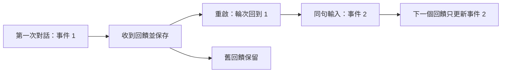

# P1 重啟後保留回饋紀錄

判定：**事件識別機制及隔離 runtime 通過；Safari／fresh-generation 品質驗收未完成**。
這是產品可靠性修正，不是新增理解能力或正式 M58 研究。

## 實際問題與修正

同一句「我需要一個現在能做的方法。」在兩次 session 都位於第 1 輪，舊版產生相同
`m18-0001-c7be2a8f6d00c427`。M27 用它覆寫 ledger，第一輪的 supported 變成 pending，兩個事件只剩一筆。
原始重現在 `p1_prediction_identity_before_2026-09-07.json`。

產品入口 `uruha_web_ui_product.py` 沿用 M54/M53 堆疊，再安裝小型 P1 adapter。事件編號新增隨 adaptive
store 保存的遞增序號；legacy entries 保留；同一 pending 的相同提交冪等，已完成 ID 的重送明確拒絕。
既有 M1–M57 程式、契約與結果未修改。人格、判斷、語句與正式授權未變。

## 證據

| 層級 | 結果與界線 |
|---|---|
| 針對性機制 | 7/7，4.44 秒；支持→保存→重啟→新事件→否定正確分離，legacy、冪等、容量淘汰、未知與決策內容等價 |
| 相鄰回歸 | 39/39，7.51 秒；M16/M17/M18/M27＋P1。9 個既有／依賴 warnings；不是全庫測試 |
| 完整產品堆疊的 mock runtime | 2 sessions、6 輪；重啟前後事件為 p1-1 與 p1-2，4 個有預測輪次的 graph 含當輪 ID，2 個沒有預測的輪次無 pending |
| 本機真實 runtime | 2 sessions、6 輪，獨立暫存 Chroma／adaptive store；8 項 identity／persistence／graph assertions 全過，6/6 保存 |
| 真實模型生成 | OpenAI-compatible qwen2.5:7b 兩次呼叫都 APITimeoutError，沒有完成生成；不能宣稱 fresh-generation 品質通過 |
| 可見日文 | 本機六輪文字由作者逐句檢查：皆為日文、無身份誤認；其中兩輪多餘澄清，體驗不合格，列 P2 |
| Safari／圖像 | 已產生既有 runtime graph HTML，尚未實際瀏覽器驗收；沒有拿 HTML 當 screenshot 或 Safari 通過 |

原始輸出：`p1_product_stack_contract_run1/2_2026-09-07.json`、`p1_product_stack_local_run1_2026-09-07.json`。
各有同名 `.html`，來自每輪實際 graph renderer；可查當輪流程，視覺品質未驗收。
XML：`p1_focused_tests_2026-09-07.xml`、`p1_adjacent_tests_2026-09-07.xml`。

單元案例保留的是 supported；六輪 runtime 原先回饋被 upstream 判為 uncertain。兩者都能保留舊紀錄，
但不能把 runtime uncertain 說成支持。記憶留得住與回饋判得準，是本次清楚分出的兩個問題。

## 失敗保留

1. 裸 Python 3.12 缺 colorama、soxr；Web import 另缺 speech_recognition。只在 gitignored
   `.venv/product_checks` 補三項依賴，版本記於 `configs/product_checks_additions.txt`；不宣稱完整可攜環境。
2. 第一個完整堆疊 probe 錯把「無預測的純結尾輪」也要求有 prediction ID，檢查失敗。保留 run1；
   修 evaluator，分別要求有預測者 graph 含 ID、無預測者無 pending。run2 原句、原回覆與實作均未改。
3. 本機原生 run 的「そう、それでいい。」與「うん、聞いてくれてありがとう。」仍被當成待澄清。
   回覆分別是「一回、今は放っといてほしいのか、少し聞いてほしいのかだけ教えて。」與
   「まあ、今は放っといてほしいのか、少し聞いてほしいのかだけ教えて。」；不算理解成功。
4. 這兩輪還觸發 general planner 並逾時。沒有重新跑到成功再覆蓋結果，也沒有補造 token usage。

## 成本及限制

50 次交錯 microbenchmark：舊決策中位 0.2827 ms，P1 中位 0.5031 ms，約增加 0.2204 ms；序號欄位在值 1
時序列化為 34 bytes；P1 新增模型呼叫 0。這不含 disk、模型、真人或瀏覽器成本。
本機六輪總 probe 44.229219 秒，各輪 1.648188／27.576236／1.384594／1.599700／1.674698／9.590482 秒。
這是单次 cold/warm 混合觀察，不是效能比較。呼叫帳本涵蓋 OpenAI-compatible 部分，native urllib／embedding
可能未完整計入；兩次逾時的 token 欄位為 null，不能當零。

適用於既有單一 writer 的 adaptive store。沒有跨程序交易鎖／崩潰後 exactly-once／任意 schema 混用保證。
不恢復歷史已被覆寫的紀錄；從新產品入口啟用後保護後續事件。未用較弱開發模型接手驗收，未做小模型品質對照。

## 下一步

P2 先修「已收到確認或致謝卻重問需求」：整句 speech act 與前一個已發出回覆必須對齊；有新問題、否定、
引述或不確定時不得被 acknowledgement 吞掉。致謝不是語意正確性的證明，不可直接增加 supported 或校準分數。
先列新的開發正／負例與前瞻標準，再小改產品入口。保留 P1 identity、正式研究與 Safari 未完成狀態。
