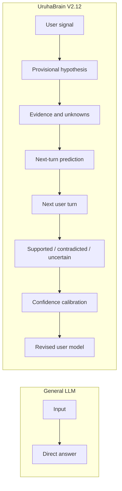

# V2.12 Functional Understanding — teacher-demo acceptance

Date: 2026-08-11  
Scope: local safe worktree only; no deployment; no claim of consciousness or human-equivalent understanding.

## The visible claim



The defensible advantage is not “UruhaBrain truly knows the user's mind.” It is that the system exposes a provisional user model, the evidence and unknowns behind it, a falsifiable next-turn prediction, and the later outcome. When a prediction is wrong, the original hypothesis remains in the trace and a correction is appended instead of silently hiding the error or converting it into factual long-term memory.

The Safari node graph presents this as:

`Hypothesis → Evidence → Prediction → Verification → Calibration → Reply`

and includes a compact comparison card:

- General LLM: `input → direct answer`; intermediate assumptions and errors are usually hidden.
- UruhaBrain V2.12: `hypothesis → evidence → prediction → later verification/denial → calibration`; the original guess remains inspectable.

## What changed

- Every user turn creates a versioned `uruha_user_mental_state_hypothesis_v2_12` record with known observations, inferred intent/emotion/dialogue goal, alternatives, unknowns, confidence, evidence provenance, and a next-user-action prediction.
- The next turn evaluates the previous prediction as `supported`, `contradicted`, or `uncertain`, records prediction error, and updates a session calibration state.
- Planning consumes the hypothesis. High uncertainty selects `functional_understanding_clarify`, which asks for one more clue in natural, low-pressure Japanese instead of fabricating context.
- Provisional mental-state hypotheses are explicitly `runtime_trace_only` with `fact_write_allowed: false`; they are not promoted to factual long-term memory.
- Identity, safety, explicit memory recall, and boundary replies remain protected from the uncertainty clarification override.
- The runtime graph has dedicated Hypothesis, Evidence, Prediction, Verification, and Calibration lanes and clickable full payloads.
- A Safari-discovered regression was repaired: `Reset Session` now returns the full Web output arity, and Japanese favorite statements such as `私の一番好きな飲み物はいちごミルク。覚えて。` store only the grounded item for later recall.

## Isolated real-Web evidence

All Web runs used an isolated database and logs under `/tmp/uruha_v2_12_acceptance.a8hEip`; they did not use the formal long-term-memory database.

Twelve Safari/Web turns were observed across two local runs. One failing pre-fix Japanese-memory recall was deliberately retained as defect evidence and then rerun after the repair.

### Contradiction and visible correction

1. User: `今天心情怪怪的。`
   - Visible reply: `しんどいなら、今日は無理すんな。`
   - Hypothesis: the user may be low, while alternatives and the actual emotion remain explicit unknowns.
   - Prediction: the user may disclose the actual emotion or deny the first interpretation.
2. User: `不是難過，我只是太興奮了。`
   - Visible reply: `うれしいことなら、一緒に喜んで。そのくらいでいいだろ。`
   - Graph: `contradicted`; `confidence -0.1`; “keep the original guess and create a revised version.”
   - Revised hypothesis: the user is correcting the system's previous interpretation; explicit excitement is marked as a user self-report.

### Supported prediction

1. User: `我今天很累，可能要休息了。`
   - Visible reply: `今日はもう粘るな。疲れてる時は休む方が先だろ。`
2. User: `嗯，我先去睡了。`
   - Visible reply: `いや、おやすみ、変な時間に起きんなよ。`
   - Graph: `supported`; confidence adjustment `+0.03`.

### High uncertainty without invention

- User: `你知道吧。`
- Visible reply: `てか、今のだけじゃ決めつけられない。もう一つだけ手掛かりちょうだい。`
- Graph: hypothesis “possibly referring to shared context, but the referent is unknown”; three unknowns; plan `functional_understanding_clarify`; prior verification `uncertain`; confidence adjustment `-0.01`.

### No-regression checks in the real Web UI

- English identity input: `Who are you?`
  - Japanese reply: `うちは一ノ瀬うるは。そこは間違えてない。`
- Japanese memory input: `私の一番好きな飲み物はいちごミルク。覚えて。`
- English memory query: `What is my favorite drink?`
  - Japanese grounded recall after the fix: `忘れてないし、いちごミルクだろ。`
- Chinese, Japanese, and English inputs all produced user-visible Japanese in the observed turns.
- Idle background cycles did not create a visible unsolicited prompt.

## Automated evidence

Command:

```text
python -m unittest -v \
  test_functional_understanding_v2_12.py \
  test_teacher_memory_observatory_v2_15.py \
  test_user_visible_japanese_guard_v2_11.py \
  test_route_logic.py \
  test_proactive_dialogue.py
```

Result: `Ran 101 tests ... OK`.

Additional checks:

- `py_compile` passed for the new module and all changed runtime/Web modules.
- `git diff --check` passed.
- The original dirty checkout was not edited; prior uncommitted V2.11 work in the safe worktree was preserved.

## Evidence boundary and remaining work

This is a functional, inspectable user-model loop, not subjective consciousness, mind reading, or human-equivalent understanding. Current semantic feature extraction and support/contradiction verification are intentionally small and partly rule-based. Calibration is session-scoped, not a validated learned probabilistic model. The local Left Brain can take roughly one minute on reflective turns. The previously preregistered V2.11 114-call fresh local-model evaluation remains unrun, so this does not establish full-pipeline or production readiness.

Estimated completion after this sprint:

- Teacher-demo key milestone: about **85%**. The differentiating scenario, live graph, multilingual Japanese output, identity, and grounded memory demo are ready; remaining work is mainly presentation polish, startup reliability, and a short scripted demo.
- V2.12 functional-understanding slice: about **80%**. Broader paraphrase coverage, more semantic verification cases, calibration validation, and longer isolated sessions remain.
- Entire long-term research goal from the handoff: roughly **60% ± 5%**. The largest remaining evidence gap is fresh preregistered evaluation and broader end-to-end robustness, not the visible demo surface.
