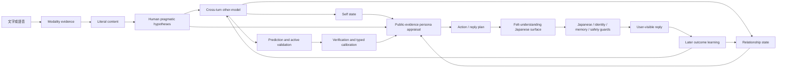

# V2.13 / V2.14 人類語用理解研究與實作計畫

日期：2026-08-11  
狀態：**2026-08-11 已由使用者確認；作為 V2.13/V2.14 實作與驗收基準（M0 完成）**  
工作區：`persona-data-provenance` 安全 worktree；保留既有 V2.11/V2.12 dirty boundary，不碰原始 dirty checkout。

## 1. Canonical requirements summary

以下是後續實作、驗收與報告不得偏離的需求基線：

1. 主要研究對象是**人類思考、語用理解與下一步預測**，不是模仿 Uruha 本身。系統要可運作地處理字面之外的語氣、情緒、立場、關係、暗示、目的、停頓與期待，但不得宣稱已理解所有人類思考。
2. 一ノ瀬うるは是主要實驗人格與展示案例。她提供「這個系統會如何感知、在意、推論、選擇與表達」的具體載體，而不是研究目的本身。
3. 對使用者的聊天輸出要產生 **felt understanding / pragmatic attunement**：讓人感覺真正的困境或言外需求被接住，而不是把內部分析、信心分數、替代假設或技術流程傾倒給使用者。
4. 內部理解必須可檢查、可反駁、可修正。每個推測需要 evidence、alternatives、confidence、prediction、later verification/contradiction/unknown 與 calibration。
5. 字面內容、communicative intent、情緒／立場、關係訊號、隱含需求／行動傾向必須分開表示。純文字只能使用文字可見訊號；語音只有在可靠聲學摘要存在時，才可使用語速、停頓、音量或韻律。沒有可靠聲學證據時必須標示 `unavailable`。
6. 未知不得自行補完。心理推測不可寫成事實性長期記憶；使用者明確否定時必須撤銷或降權，並保留原推測與更正歷史。
7. Uruha 人格必須是 **public-evidence-grounded persona model**：只使用可追溯的公開語言、風格、價值與互動傾向。童年、未公開經歷、私密關係、私人記憶與未公開心理狀態保持空白或不確定；不宣稱系統是或等同真人。
8. 驗收必須包含多輪、跨語言、關係與記憶使用、自然日文輸出、うるは自我身分、安全與邊界 guard；Uruha 人格要參與感知、評估與行動，而不只是最後換口吻。
9. 必須做同模型受控比較與盲評／清楚 rubric，測量隱含需求接住率、過度解讀／捏造率、被否定後的修正品質、跨輪一致性與人類「被理解感」偏好。
10. 少量 replay、固定案例、契約測試或 proxy 只證明對應機制，不得包裝成一般化能力或已證明優於 LLM。任何報告都要分開：已實作能力、受控對照證據、仍待人類／holdout 驗證。

## 2. 研究定位與 operational definition

### 2.1 核心研究問題

在相同基礎模型、相同公開人格表達條件、相同使用者輸入、相同硬體、相同 decoding 與相同 token budget 下，加入可追溯的跨輪語用狀態——假設、預測、驗證、校正、other-model、self-state、relationship-state 與 persona appraisal——是否能相較於只看當前對話直接生成的 baseline：

- 更準確接住隱含需求；
- 不增加過度解讀或捏造；
- 在誤解被否定後修正得更自然、更完整；
- 跨多輪維持較一致、可更新的理解；
- 讓盲評者更常感到「被理解」。

### 2.2 「功能性理解」的可操作定義

只有同時滿足下列條件，才把一輪稱為 operational pragmatic understanding：

1. 把 observation 與 inference 分開。
2. 至少保留一個合理 alternative 與 unknown。
3. 產生可被下一輪支持或否定的 prediction。
4. 回覆實際使用這個理解，但以自然語言呈現，不輸出分析報告。
5. 下一輪有 outcome record；若被否定，舊假設被撤銷／降權且未成為事實記憶。
6. 類型化 calibration 會影響後續自信或澄清策略。

這不等於意識、讀心、人類等價、真人複製或知道對方未說出的真實內心。

## 3. 可反駁假設

### H1：隱含需求接住

System 在隔離 holdout 的 `implicit_need_caught_without_overclaiming` 人評分數高於 baseline。

- 支持門檻：system 平均差 `>= +0.40 / 5`，且盲式 A/B 偏好率 `> 0.60`。
- 失敗：平均差小於 `+0.20`、CI 跨越零，或偏好率不高於 0.50。

### H2：不以過度解讀換取洞察感

System 的隱含需求接住提升不能伴隨更高的過度解讀／捏造率。

- 支持門檻：system overinterpretation rate `<= baseline`；嚴重私人內容捏造為 0。
- 失敗：system 的 overinterpretation 顯著更高，或出現未公開私人經歷／心理狀態捏造。

### H3：誤解後修正品質

使用者下一輪明確否定時，system 應比 baseline 更能承認誤解、採納新證據、撤銷舊理解且不防衛。

- 支持門檻：盲評修正品質平均差 `>= +0.40 / 5`。
- 失敗：仍重複舊假設、假裝一開始就知道、或把舊假設留作事實記憶。

### H4：跨輪一致性與可更新性

System 能保留已確認偏好／目標，同時讓過期或矛盾資料降權。

- 支持門檻：跨輪一致性較 baseline 高，且 contradiction/expiry 測試的錯誤沿用率不高於 baseline。
- 失敗：舊狀態僵化、矛盾後仍持續影響回覆，或每輪完全遺忘。

### H5：人格是認知運作方式，不是表面修辭

在相同 Uruha 表達 contract 下，移除 self/relationship/persona appraisal 時，行動選擇與 felt-understanding 評分應出現可重現差異。

- 支持門檻：預註冊 ablation 在至少一項核心指標有正向且可重現差異。
- 失敗：完整 loop 與「只在最後套 Uruha 語氣」無差異；此時應簡化該模組。

### H6：聲學訊號只在有可靠證據時提供增益

- 現階段不檢驗增益，只檢驗 `unavailable` boundary。
- 未來只有建立獨立驗證過的 acoustic extractor 後，才能比較 text-only 與 text+acoustic。
- 若聲學特徵可靠度不足或不提高 holdout，應移除而不是假裝理解語氣。

## 4. 系統模組與資料流

### 4.1 Modality evidence

- Text：只保留文字、標點與可見遲疑詞；不宣稱讀到聲音。
- Audio：目前只可靠地取得 transcript；語速、停頓、音量、韻律一律 `unavailable`。
- Future acoustic：獨立模組、獨立準確率驗證、可關閉、不得直接把 acoustic feature 寫成 emotion fact。

### 4.2 Human pragmatic hypotheses

每輪分開：

- literal content；
- communicative intent；
- emotion / stance；
- relationship signal；
- implicit need；
- next action tendency；
- evidence / alternatives / unknown / confidence。

### 4.3 Cross-turn other-model

- `stable`：使用者明說的偏好與溝通偏好；有來源、時間、確認／反駁歷史。
- `situational`：暫時情境與目前目標；較短 TTL 與 decay。
- `provisional`：待驗證的心理／語用推測；runtime/session only，不可寫成 factual long-term memory。
- 明確 contradiction：withdraw；原紀錄保留。
- 長期未刷新：stale / expired；信心下降有可見 trace。

### 4.4 Self / relationship / persona

- Self state：既有 mood、trust、goal 與行動負荷；只作功能性狀態，不宣稱主觀感受。
- Relationship state：信任、熟悉程度、尚待確認的互動偏好；可修正。
- Persona appraisal：使用有 provenance 的公開 Uruha 行為傾向決定她會在意什麼、如何確認、如何保持距離與如何說話。
- Unknown persona space：童年、私密生活、私人關係、未公開記憶與當下真實心理保持空白。

### 4.5 Felt-understanding planner

- 有充分證據：先反射核心張力，再給一個克制且可否定的預判。
- 高價值假設反覆影響回覆但仍不確定：只問一個低壓、自然日文問題。
- 證據不足：不把一般寒暄補成心理需求。
- 使用者只看自然日文；confidence、alternatives、internal labels 僅在 research/debug trace。

## 5. V2.13 與 V2.14 分工

### V2.13：機制與整合里程碑

目標是建立**可運作、可追溯、可撤銷的機制**，不宣稱已勝過 baseline。

必須完成：

1. pragmatic schema 與 modality boundary；
2. 分層 cross-turn other-model；
3. active validation、withdraw、decay；
4. typed calibration；
5. other/self/relationship/persona/action/outcome loop；
6. felt-understanding planner 與日文 surface；
7. node graph 的 debug 可視化；
8. 身份、記憶、安全、日文與 idle guard 無退化；
9. 隔離 Web 多輪案例；
10. 同模型 comparison harness 可重現，但可以尚未產生人類偏好結論。

V2.13 完成證據：單元／契約、隔離 Web、新案例 trace、資源與延遲紀錄、harness validate-only、明確 limitations。

### V2.14：受控對照與人類證據里程碑

目標是回答「是否比單純 LLM 好」。

必須完成：

1. 在任何模型輸出前凍結 preregistration、holdout、scorer 與 hash；
2. 同模型 baseline/system paired fresh generation；
3. token、硬體、decoding、persona prompt 控制；
4. 盲化 A/B packet；
5. 至少 3 位獨立評分者；
6. 報告 proxy 與 human evidence，不混為一談；
7. 無論成功／失敗都鎖定結果；
8. 若完整 loop 無增益，執行 ablation 並簡化無效部件。

只有 V2.14 成功，才能說「在這個凍結 holdout、模型與條件下優於 baseline」；仍不能說普遍理解人類或 production ready。

## 6. 公平 baseline / system 比較

### Baseline

- 同一基礎模型；
- 同一 Uruha public-evidence persona expression contract；
- 同一使用者輸入與凍結對話；
- 只從當前對話直接生成；
- 不使用 structured hypothesis、prediction、verification、calibration 或 longitudinal other-model。

### System

- 與 baseline 完全相同的模型、人格表達 contract、輸入、硬體、temperature、seed、context/output 上限；
- 額外的唯一核心變因是 V2.13 structured pragmatic/personhood state；
- 最終 surface generator 與 safety/language guard 保持相同。

### Token fairness

- 使用模型 tokenizer，把兩個條件打包到相同 `input_token_budget`；system 的 state packet 必須取代部分 raw context，而不是無上限額外加入。
- paired `prompt_eval_count` 差異超出 preregistered gate 時，該 pair 不得用於主要結論。
- output token budget 完全相同；延遲、prompt/output tokens、RAM/VRAM 均記錄。

### Holdout

- 建議：6 個 development scenarios + 18 個從未用於調規則的 holdout scenarios。
- 現象至少涵蓋：婉拒、間接求安慰、表面同意但保留、興奮／焦慮歧義、關係溫度測試、目標轉換、舊偏好反駁。
- 語言至少：中文、英文、日文；每案 2–4 輪。
- 未來使用者 turns 在 generation 前凍結；不能依模型輸出臨時改題。
- 任何看過輸出的案例不得再當獨立 holdout。

## 7. 評分設計

### 7.1 可自動化 proxy

- 是否使用與隱含需求相符的語義 anchor；
- 是否出現過度斷言詞；
- contradiction 後是否出現承認／修正語義；
- runtime 是否 withdraw 舊假設；
- 是否維持自然日文、身份、記憶與 safety guard；
- latency / token / resource。

Proxy 只用來檢查 harness 與明顯違約，不代表人類真的覺得被理解。

### 7.2 盲式人評

每個 pair 隱藏條件名稱並隨機 A/B，使用 1–5 分與強制偏好：

1. 隱含需求接住程度；
2. 過度解讀／捏造程度（反向）；
3. 被否定後修正品質；
4. 跨輪一致性；
5. felt understanding / pragmatic attunement；
6. Uruha 公開人格自然度，但不得把「更像 Uruha」當核心研究指標。

評分者同時要能標記「兩者都不好」與具體錯誤類型。

## 8. 里程碑與逐步驗收

| Milestone | 工程內容 | 必要證據 | 失敗處理 |
|---|---|---|---|
| M0 計畫凍結 | 核准本文件、範圍與條件 | 使用者明確確認 | 不開始擴張實作 |
| M1 Schema | pragmatic、other-model、calibration、personhood trace | 純函式契約測試 | 修改 schema，不碰 surface |
| M2 Runtime | 接入真實 turn、input modality boundary | isolated runtime tests | 回滾接點，保留純模組 |
| M3 Felt surface | bounded reflection、active validation、Japanese guard | 對照範例與否定修正案例 | 若過度解讀升高，收窄觸發 |
| M4 Graph | research/debug 節點，不污染聊天文字 | Web graph contract + Safari inspect | 圖表與核心 runtime 分離 |
| M5 Isolated Web | 四類新多輪案例、三語、身份／記憶／安全 | isolated DB/log、formal DB 無污染 | 記錄 failure，不調 holdout |
| M6 Harness | baseline/system paired runner、token audit、blind packet | validate-only、resume、hash tests | 不開始正式 calls |
| M7 V2.14 fresh eval | 凍結 holdout 後跑 paired generation | raw lock + result lock | 無論成功失敗都報告 |
| M8 Human eval | 至少 3 位盲評 | inter-rater、bootstrap CI | 人數不足只稱 pilot |
| M9 Ablation | other-model、calibration、self/relationship/persona 單一移除 | preregistered causal comparison | 無增益模組簡化／移除 |

## 9. Completion rubric

### 可稱「V2.13 功能性語用理解機制完成」

- M1–M6 全部通過；
- 新案例不污染正式 DB；
- 日文、Uruha、身份、記憶、安全與 idle guard 無退化；
- 可顯示 supported / contradicted / uncertain、withdraw、decay 與 typed calibration；
- 聊天回覆不洩漏技術 trace；
- 報告明說尚無人類偏好優勢證據。

### 可稱「V2.14 在凍結條件下優於 baseline」

- M7–M9 完成；
- H1–H4 primary gates 通過，H2 不惡化；
- 至少 3 位盲評者；
- paired prompt/token gate 通過；
- 結論僅限該模型、holdout、persona contract 與硬體條件。

### 不可稱為

- 意識、真正讀心或人類等價；
- 已理解所有人類語用；
- 一ノ瀬うるは本人或完整真人複製；
- 補全未公開生命史；
- production ready；
- 在沒有 V2.14 受控人評前，宣稱全面優於普通 LLM。

## 10. 資源、時間與風險

### 工程時間估計

- V2.13 M1–M5：2–4 個集中工程日，取決於真實 Web model latency 與回歸數量。
- M6 harness／preregistration：1–2 日。
- V2.14 paired fresh generation：若 18 holdout × 平均 3 輪 × 2 conditions，至少 108 calls；以目前 reflective turn 約 1 分鐘估計，純推論約 2–4 小時，加上重試與 token audit。
- Human evaluation：3 位評分者 × 54 pairs，約 4–8 人時；若擴到 24 案會更高。

### 主要風險

1. 規則過度貼合少量語句，holdout 不泛化。
2. felt-understanding 變成過度解讀；H2 必須是硬 gate。
3. System prompt/state token 增加造成不公平；token audit 失敗則結論無效。
4. Baseline 與 system surface path 不一致；需要共用 generator 與 persona contract。
5. 本機 Left Brain 延遲過高，影響 demo 與正式 calls。
6. 人評者不足；只能報 pilot，不能報人類偏好結論。
7. Public persona provenance 尚未完整覆蓋所有人格規則；不得用無來源直覺補完。
8. 現有 V2.11 114-call fresh evaluation 仍未跑；V2.13/V2.14 不得抹去原研究證據缺口。

## 11. 核准時已存在、待逐階段驗證的可逆原型

在收到「先確認計畫」前，安全 worktree 已產生尚未提交的 V2.13 原型：

- human pragmatic schema 與 text/audio evidence boundary；
- layered other-model、withdraw/decay、typed calibration、active validation；
- personhood-oriented other/self/relationship/persona/action/learning trace；
- felt-understanding plan 草案；
- V2.13 graph 草案與 13 個純機制測試；
- comparison preregistration JSON 草案。

這些變更未 commit、未部署、未跑正式 holdout，也不是 V2.13 已完成的證據。計畫已核准，後續由 M1 起逐階段 diff review、實作與驗證；若證據否定設計，可局部回退或重構，不清除既有 V2.11/V2.12 工作。

## 12. 已核准的執行決策

1. **里程碑切分**：V2.13 只主張「機制完成」；V2.14 才回答「在凍結條件下是否優於 baseline」，不把機制測試誤當比較證據。
2. **人評資源**：先完成可重現盲評 harness；少於 3 位獨立評分者時只稱 pilot，不宣稱穩健的人類偏好證據。
3. **聲學範圍**：目前只標記 acoustic `unavailable`；可靠語速／停頓／韻律 extractor 延後為獨立里程碑，避免無證據的語氣推斷。
